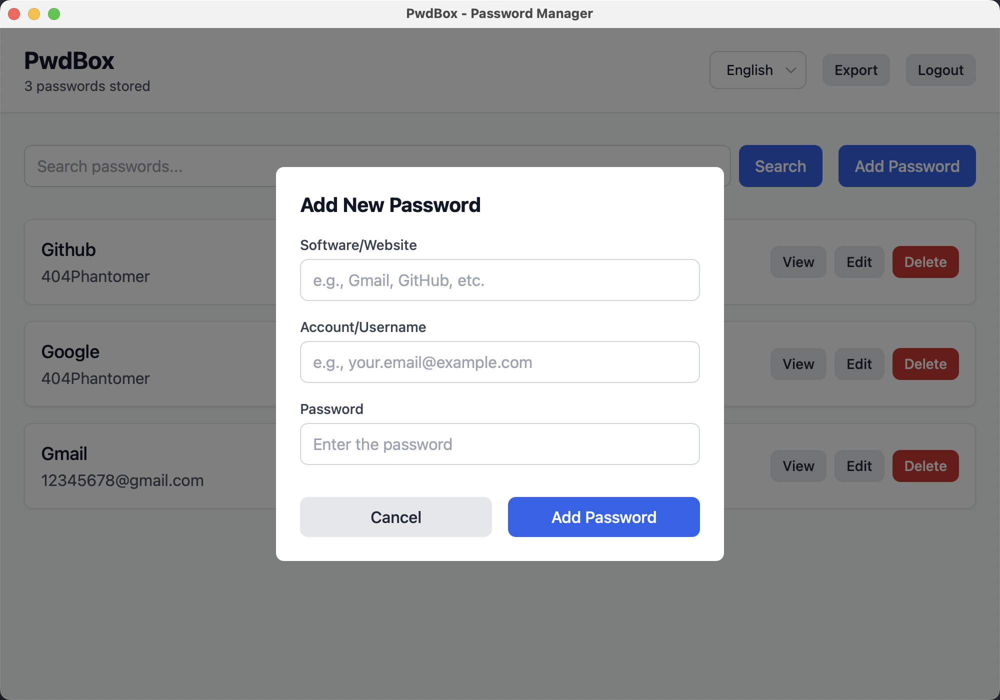

📘 [中文文档](./README.zh-CN.md)

# 🔐 pwdbox

**pwdbox** is a secure, cross-platform, offline-first password manager built with [Tauri](https://tauri.app/), [Rust](https://www.rust-lang.org/), and [React](https://react.dev/). It allows you to safely store and manage all your software account credentials entirely on your own device — no cloud, no tracking, no compromise.

---

## ✨ Features

- 🔑 **Master password login** — unlock access to all your data
- 🧠 **Password recovery** — reset your master password using 3 security questions
- 🗃️ **Offline local storage** — no internet access required, 100% private
- 🔐 **AES-GCM encryption** — all passwords are encrypted with a master-derived key
- 📦 **Export / Import support** — securely migrate your vault between devices
- 🖥️ **Cross-platform** — macOS, Windows, Linux, iOS*, Android*
- 🧩 **Search & manage entries** — tag, filter and organize accounts
- 🧘‍♀️ **Minimal UI** — focused on simplicity and usability

> iOS and Android are supported via [Tauri v2 mobile](https://tauri.app/v2/guides/platforms/mobile/), and may require beta setup.

---

## 📸 Screenshots

<!-- Replace with actual images once UI is built -->
<h3 align="center">Login</h3>
<p align="center">
  
</p>

<h3 align="center">Add</h3>
<p align="center">
  
</p>

<h3 align="center">Dashboard</h3>
<p align="center">
  
</p>


---

## 🔧 Installation

> Requires: Node.js, Rust, Cargo, Tauri CLI

```bash
# 1. Clone this repo
git clone https://github.com/yourname/pwdbox.git
cd pwdbox

# 2. Install frontend dependencies
pnpm install   # or yarn / npm

# 3. Run the app in development mode
pnpm tauri dev

# 4. Build for release
pnpm tauri build
```
---


## 🧱 Tech Stack

| Layer     | Tech                                                  |
|-----------|-------------------------------------------------------|
| Frontend  | React + Tailwind CSS                                  |
| Backend   | Rust (Tauri backend)                                  |
| Storage   | SQLite via `rusqlite`                                 |
| Encryption| AES-GCM (for passwords)                               |
| Hashing   | Argon2 + Salt (for master password and recovery answers) |
| Packaging | Tauri cross-platform bundler                          |

---

## 🔐 Security Architecture

- All data is encrypted locally using a key derived from your master password.
- No plaintext passwords or keys are ever stored on disk.
- Security questions are stored as salted Argon2 hashes.
- Exported vault files are encrypted with a user-provided export passphrase.
- Tauri ensures secure sandboxing and native OS integration.

---

## 📤 Export / Import

You can export your full vault into an encrypted `.enc` file and later restore it on another device using the same export password.  
All data remains encrypted end-to-end.

---

## 🤝 Contributing

We welcome contributions!

```bash
# Fork the repo, then:
git clone https://github.com/yourname/pwdbox.git
pnpm install
pnpm tauri dev
```
---
## 🛣️ Roadmap

- [x] SQLite-based secure local storage  
- [x] Master password protection  
- [x] Recovery via security questions  
- [x] Cross-platform Tauri support  
- [x] Export/Import with encryption  
- [ ] Mobile UI optimizations  
- [ ] Biometric unlock (TouchID / FaceID)  
- [ ] Cloud sync (optional, encrypted)

---

## 📄 License

This project is licensed under the [MIT License](LICENSE).


