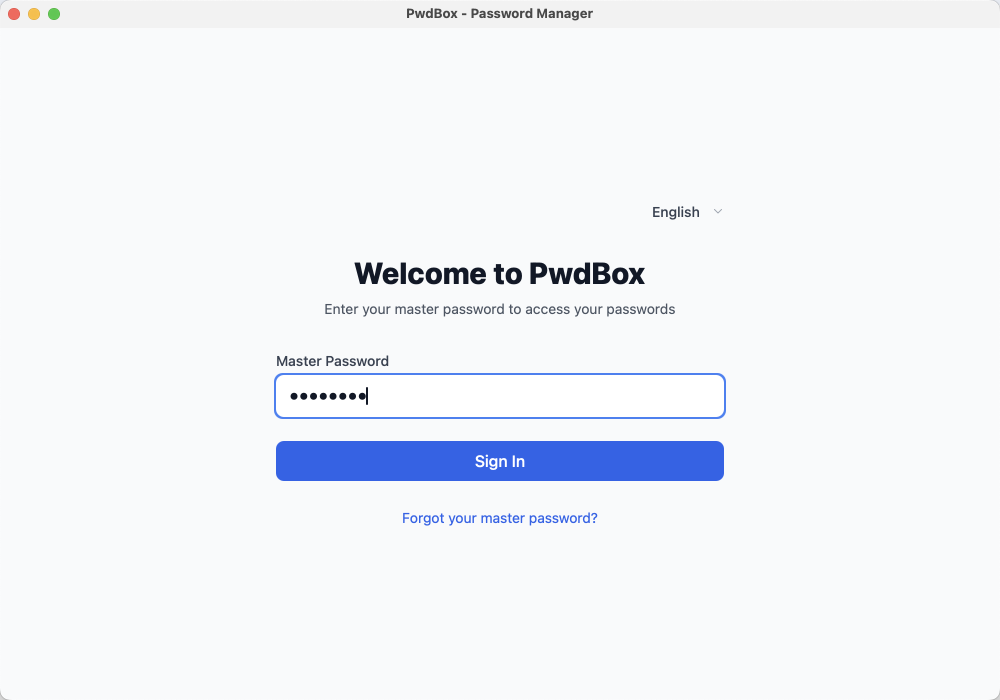
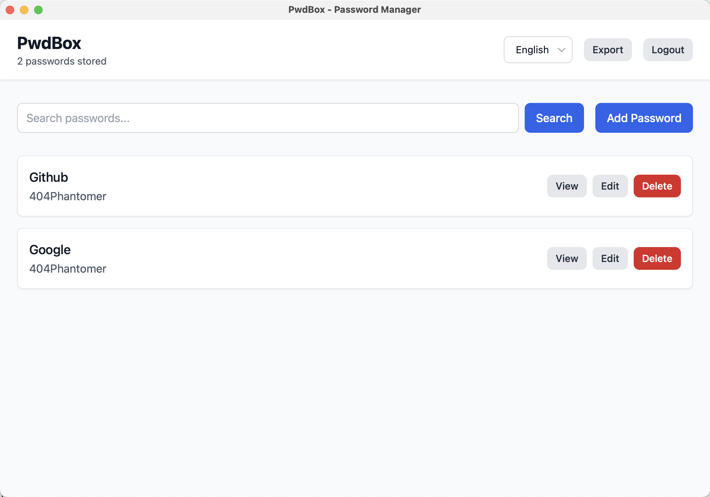

📗 [English](./README.md)

# 🔐 pwdbox

**pwdbox** 是一个基于 [Tauri](https://tauri.app/)、[Rust](https://www.rust-lang.org/) 和 [React](https://react.dev/) 构建的跨平台、离线优先的安全密码管理器。它允许你在本地安全地存储和管理所有软件账户的密码——无需联网、无追踪、无妥协。

---
## ✨ 功能亮点

- 🔑 **主密码登录** — 使用主密码解锁访问全部数据  
- 🧠 **密码找回机制** — 可通过预设的三个安全问题重置主密码  
- 🗃️ **本地离线存储** — 完全离线运行，数据仅保存在设备本地  
- 🔐 **AES-GCM 加密** — 所有密码使用主密码派生密钥加密  
- 📦 **导出 / 导入支持** — 便捷迁移密码库到其他设备  
- 🖥️ **跨平台支持** — 支持 macOS、Windows、Linux、iOS\*、Android\*  
- 🧩 **密码项搜索与管理** — 可分类、检索和管理账户  
- 🧘‍♀️ **极简 UI** — 专注于安全与易用性，界面清爽

> \* iOS 和 Android 支持基于 [Tauri v2 Mobile](https://tauri.app/v2/guides/platforms/mobile/)，可能需要额外配置。

---
## 📸 界面截图

<!-- 构建完成 UI 后替换下面图片路径 -->
<p align="center">
  
  
</p>

---
## 🔧 安装方法

> 依赖：Node.js、Rust、Cargo、Tauri CLI

```bash
# 1. 克隆项目
git clone https://github.com/yourname/pwdbox.git
cd pwdbox

# 2. 安装前端依赖
pnpm install   # 或使用 yarn / npm

# 3. 启动开发环境
pnpm tauri dev

# 4. 构建正式版本
pnpm tauri build
```

---
## 🧱 技术栈

| 层级       | 技术                                  |
|------------|---------------------------------------|
| 前端       | React + Tailwind CSS                  |
| 后端       | Rust（Tauri 框架）                    |
| 存储       | SQLite（通过 `rusqlite` 访问）        |
| 加密算法   | AES-GCM（用于密码加密）               |
| 哈希算法   | Argon2 + Salt（用于主密码和找回答案） |
| 应用打包   | Tauri 跨平台打包工具                  |

---
## 🔐 安全架构

- 所有数据都使用主密码派生的密钥进行本地加密；
- 不会在磁盘上保存任何明文密码或密钥；
- 安全问题的答案采用带盐的 Argon2 哈希存储；
- 导出的密码库文件使用用户提供的密码进行加密；
- Tauri 提供系统级别的沙箱隔离和本地集成保障安全性。

---

## 📤 导出 / 导入

你可以将完整的密码库导出为加密的 `.enc` 文件，在新设备上使用相同的导出密码恢复。  
整个过程端到端加密，确保数据始终安全不泄露。

---
## 🤝 贡献指南

我们欢迎任何形式的贡献！

```bash
# Fork 本项目，然后：
git clone https://github.com/yourname/pwdbox.git
pnpm install
pnpm tauri dev
```

---
## 🛣️ 开发路线图

- [ ] 基于 SQLite 的安全本地存储  
- [ ] 主密码保护机制  
- [ ] 通过安全问题找回主密码  
- [ ] 跨平台 Tauri 支持  
- [ ] 加密导出/导入功能  
- [ ] 移动端界面优化  
- [ ] 生物识别解锁（TouchID / FaceID）  
- [ ] 云同步（可选，加密）

---
## 📄 开源许可

本项目基于 [MIT 许可协议](LICENSE) 开源发布。


